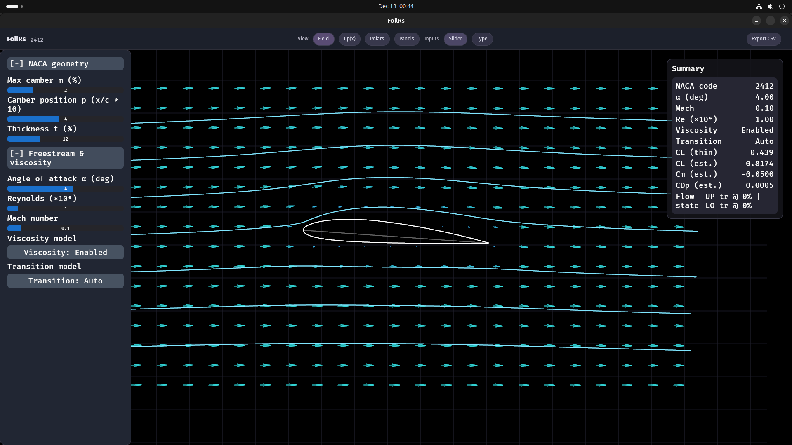
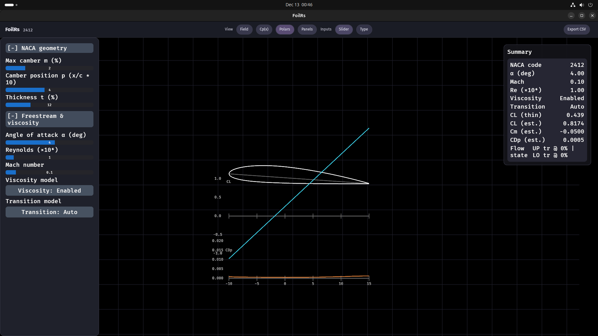
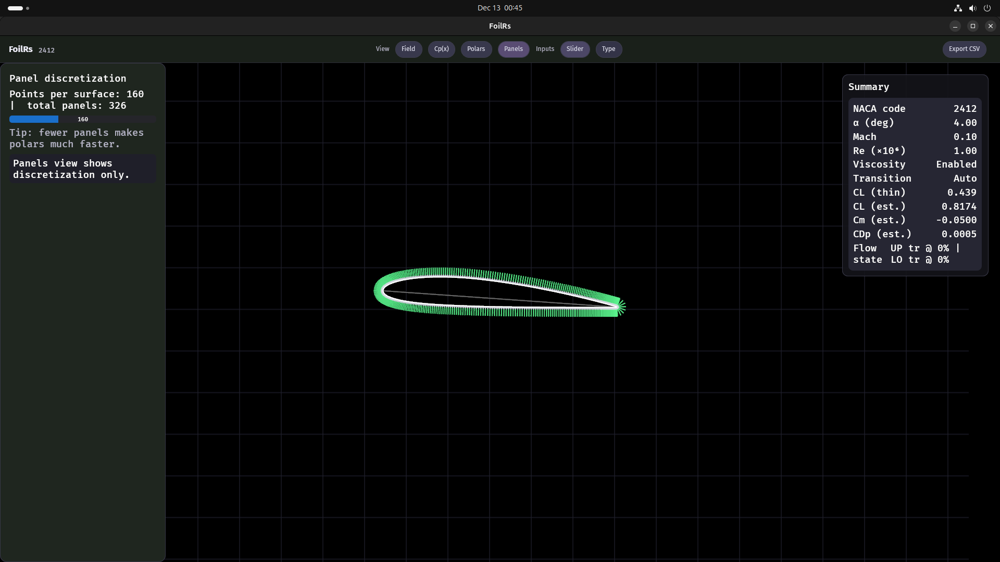
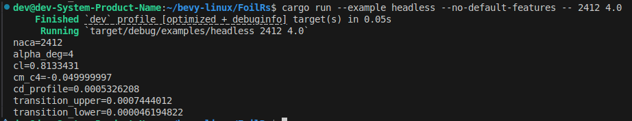

# FoilRs

Interactive airfoil playground inspired by XFoil: a fast Bevy-based UI for exploring NACA 4‑digit sections, visualizing the flow field, Cp(x), panel discretization, and simple α-sweep “polars”, with CSV export.

This is **not** a full XFoil port yet. It aims to be a practical, visual tool first, with clear limitations and a roadmap toward more XFoil-like fidelity.

## Features

- **NACA 4‑digit generator** (m/p/t) with live geometry updates.
- **Views** (top bar):
  - **Field**: velocity arrows + streamlines around the airfoil.
  - **Cp(x)**: upper/lower Cp curves with consistent coloring on the airfoil outline.
  - **Polars**: α sweep showing CL(α) and CDp(α).
  - **Panels**: panel discretization visualization.

## Screenshots

### Field



### Cp(x)

.png>)

### Polars



### Panels



### Headless mode



- **Flow settings**
  - Angle of attack α (deg)
  - Reynolds number (×10⁶ input)
  - Mach number
  - Viscosity toggle + transition mode toggle (auto vs forced trip)
- **Export**
  - **Export CSV** button writes the current α-sweep polar to `exports/`.
- **UI input modes**
  - Switch between **Slider** and **Type** input modes from the top bar.
  - Type mode supports click-to-focus, keyboard editing, `Enter` to commit, `Esc` to cancel.

## What’s “modeled” (high level)

FoilRs currently combines three layers:

1. **Inviscid panel flow (visualization + Cp sampling)**
   - Constant-strength vortex panel method with a Kutta condition.
   - Produces a velocity field (used in **Field** view) and Cp samples (used in **Cp(x)**).
2. **Compressibility correction (visualization/field)**
   - Prandtl–Glauert scaling is applied in the field sampling and Cp view (subsonic).
3. **Boundary-layer estimate (for CDp and “flow state”)**
   - Lightweight integral-style estimate using Cp-derived edge velocity.
   - Produces an approximate profile drag `CDp`, plus heuristic transition/separation indicators.

## Important differences vs XFoil

XFoil is a mature viscous–inviscid coupled solver with sophisticated transition modeling and iterative convergence logic. FoilRs is earlier-stage:

- **No viscous–inviscid coupling iterations** (yet).
- **Transition/separation are heuristics**, not an e^N method.
- **Re effects in Cp(x)**: currently Reynolds can influence the *visual* Cp magnitude (for readability) even though in XFoil the main Re effect is via viscous coupling. Treat Cp(x) here as primarily an inviscid picture.
- **CL/CM summary values**: CL/CM are currently “stabilized” with tuned analytic coefficients in some paths; they are not yet purely panel-integrated coefficients.

If you need “trustworthy XFoil numbers”, use XFoil as the reference. If you want an interactive, visual tool to understand trends and debug geometry/discretization, FoilRs is useful today.

## Usage

### Run (GUI)

```bash
cargo run
```

### Use as a library (no Bevy)

FoilRs’ solver + geometry code can be used without the Bevy UI by disabling default features:

- In your `Cargo.toml`: `foil_rs = { path = ".../FoilRs", default-features = false }`
- Or run the included headless example:

```bash
cargo run --example headless --no-default-features -- 2412 4.0
```

### Benchmark (headless)

Quick timing harness (no extra deps), recommended in `--release`:

```bash
cargo run --example bench_headless --no-default-features --release -- 2412 4.0
```

Args (all optional): `NACA ALPHA_DEG PANEL_ITERS POLAR_ITERS ALPHA_MIN ALPHA_MAX ALPHA_STEP`

### Controls

- **View selector**: top bar → `View` (Field / Cp(x) / Polars / Panels)
- **Inputs**: top bar → `Inputs`
  - **Slider**: simple sliders only
  - **Type**: numeric boxes only (click box → type → `Enter`)
- **Export**: top bar → `Export CSV` (writes to `exports/`)

### Performance tips

- **Polars** are an α-sweep (many solves). If it’s too slow:
  - Switch to **Panels** view and reduce **Points per surface** (fewer panels).
  - Increase α step size (planned; currently fixed).

## Project structure

- `src/ui/` — UI layout + systems (top bar, left panel, input mode, export).
- `src/views/` — visualization layers (Field/Cp/Polars/Panels).
- `src/solvers/` — panel solver + boundary-layer estimate + polar sweep helper.
- `tests/` — sanity tests that catch sign/convention regressions.

## Roadmap

See `TODO.md` for the current checklist. Big items:

- Multi-polars across Reynolds/Mach (multiple curves + faster caching)
- Import `.dat` airfoils + normalization utilities
- Better XFoil alignment: conventions, coupling, and validation datasets

## License

See `LICENSE`.
