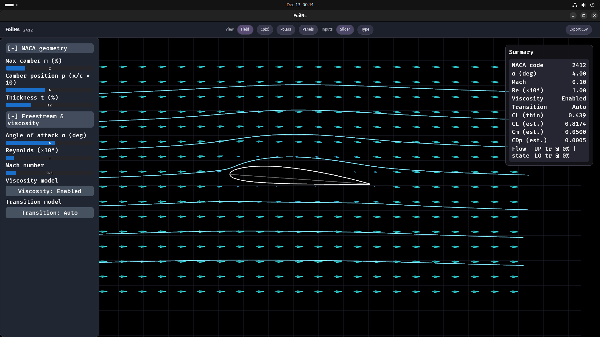
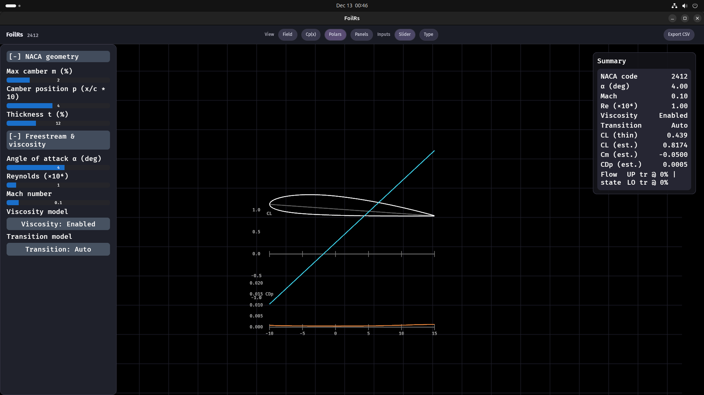
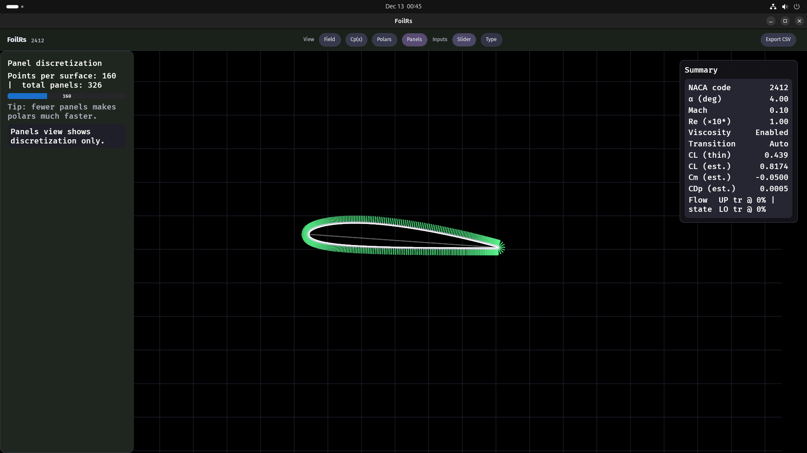
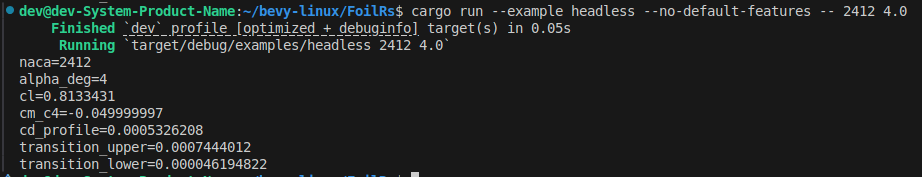

# FoilRs

Interactive airfoil playground inspired by XFoil: a fast Bevy-based UI for exploring NACA 4‑digit sections, visualizing the flow field, Cp(x), panel discretization, and simple α-sweep “polars”, with CSV export.

This is **not** a full XFoil port yet. It aims to be a practical, visual tool first, with clear limitations and a roadmap toward more XFoil-like fidelity.

## Features

- **NACA 4‑digit generator** (m/p/t) with live geometry updates.
- **Views** (top bar):
  - **Field**: velocity arrows + streamlines around the airfoil.
  - **Cp(x)**: upper/lower Cp curves with consistent coloring on the airfoil outline.
  - **Polars**: α sweep showing CL(α) and CDp(α).
  - **Panels**: panel discretization visualization.

## Screenshots

### Field



### Cp(x)

.png>)

### Polars



### Panels



### Headless mode



- **Flow settings**
  - Angle of attack α (deg)
  - Reynolds number (×10⁶ input)
  - Mach number
  - Viscosity toggle + transition mode toggle (auto vs forced trip)
- **Export**
  - **Export CSV** button writes the current α-sweep polar to `exports/`.
- **UI input modes**
  - Switch between **Slider** and **Type** input modes from the top bar.
  - Type mode supports click-to-focus, keyboard editing, `Enter` to commit, `Esc` to cancel.

## What’s “modeled” (high level)

FoilRs currently combines three layers:

1. **Inviscid panel flow (visualization + Cp sampling)**
   - Constant-strength vortex panel method with a Kutta condition.
   - Produces a velocity field (used in **Field** view) and Cp samples (used in **Cp(x)**).
2. **Compressibility correction (visualization/field)**
   - Prandtl–Glauert scaling is applied in the field sampling and Cp view (subsonic).
3. **Boundary-layer estimate (for CDp and “flow state”)**
   - Integral BL (Thwaites) with Squire-Young profile drag at the trailing edge.
   - Produces realistic `CDp` (within 1-12% of XFoil at moderate alpha), plus heuristic transition/separation indicators.

## Solver accuracy

Validated against XFoil 6.99 and Abbott & Von Doenhoff reference data via
`cargo val`.  Run `cargo val-history` to see accuracy trends.

| Metric | NACA 0012 (symmetric) | NACA 2412 (cambered) |
|---|---|---|
| CL_alpha | 1.3% error | 3.6% error |
| CD_min | 1.5% error | 0.3% error |
| CL (mean, 0-10°) | 2.0% error | 11% error (at positive alpha) |
| CD (mean, 0-10°) | 7.7% error | 11.5% error |

CL is computed from panel-integrated pressure forces (Kutta-Joukowski).
CD uses the Squire-Young formula (momentum thickness at the trailing edge).

## Important differences vs XFoil

XFoil is a mature viscous-inviscid coupled solver with sophisticated
transition modeling and iterative convergence logic.  FoilRs is earlier-stage:

- **No viscous-inviscid coupling iterations** (yet).
- **Transition/separation are heuristics**, not an e^N method.
- **Cambered airfoil CL offset** is under-predicted (~20-30% at alpha=0 for
  NACA 2412/4412) due to collocation-point Cp sampling near the LE.
- **Thin airfoils** (t/c < 10%) over-predict CL by ~30% due to panel
  discretisation sensitivity.

If you need reference numbers, use XFoil.  FoilRs is useful today as an
interactive visual tool, and as a library dependency for downstream solvers
that need section polars with known accuracy bounds.

## Usage

### Run (GUI)

```bash
cargo run
```

### Use as a library (no Bevy)

FoilRs’ solver + geometry code lives in the `foil_rs` crate (no Bevy dependency):

- From crates.io: `foil_rs = "0.1"`
- Or for local development: `foil_rs = { path = ".../FoilRs/crates/foil_rs" }`
- Or run the included headless example:

```bash
cargo run -p foil_rs --example headless -- 2412 4.0
```

### Benchmark (headless)

Quick timing harness (no extra deps), recommended in `--release`:

```bash
cargo run -p foil_rs --example bench_headless --release -- 2412 4.0
```

Args (all optional): `NACA ALPHA_DEG PANEL_ITERS POLAR_ITERS ALPHA_MIN ALPHA_MAX ALPHA_STEP THREADS RUNS WARMUP_RUNS`

### Export polars CSV (headless)

Writes an α-sweep CSV to `exports/` (no Bevy required):

```bash
cargo run -p foil_rs --example export_polar_csv --release -- 2412
```

Args (all optional): `NACA REYNOLDS MACH VISCOUS FREE_TRANSITION ALPHA_MIN ALPHA_MAX ALPHA_STEP THREADS OUT_PATH`

### Export multi-polars CSV (headless)

Writes a combined CSV containing multiple α-sweep curves across Reynolds/Mach pairs:

```bash
cargo run -p foil_rs --example export_multi_polars_csv --release -- 2412 "0.5,1.0,2.0" "0.0,0.1"
```

Args (all optional): `NACA RE_MILLIONS_LIST MACH_LIST VISCOUS FREE_TRANSITION ALPHA_MIN ALPHA_MAX ALPHA_STEP THREADS OUT_PATH`

### Controls

- **View selector**: top bar → `View` (Field / Cp(x) / Polars / Panels)
- **Inputs**: top bar → `Inputs`
  - **Slider**: simple sliders only
  - **Type**: numeric boxes only (click box → type → `Enter`)
- **Export**: top bar → `Export CSV` (writes to `exports/`)

### Performance tips

- **Polars** are an α-sweep (many solves). If it’s too slow:
  - Switch to **Panels** view and reduce **Points per surface** (fewer panels).
  - Increase α step size (planned; currently fixed).

## Development

### Quality assurance

```bash
cargo qa          # fmt + clippy + tests + ignored tests + validation
cargo val         # validate solver against reference airfoil data
cargo val-history # show accuracy trend across validation runs
cargo cov         # HTML code coverage report (requires cargo-llvm-cov)
```

Enable the repo-local Git hook to auto-format on commit:

```bash
./scripts/setup-git-hooks.sh
```

### Release checklist

Run the local checks before pushing a tag:

```bash
cargo qa
./scripts/release-check.sh --publish-dry-run
```

Note: the publish dry-run only validates `foil_rs` locally; `foil_rs_bevy` depends on that version being on crates.io.

To match the binary release workflow locally:

```bash
./scripts/release-check.sh --release-binary
```

## Project structure

- `crates/foil_rs/` — core solver + geometry + headless examples/tests (no Bevy).
- `crates/foil_rs_bevy/` — Bevy UI + visualizations and the `FoilRs` app.

## Roadmap

See `TODO.md` for the current checklist and known solver issues.  Big items:

- Fix cambered-airfoil CL zero-lift offset and thin-airfoil CL over-prediction
- Import `.dat` airfoils + normalization utilities
- Viscous-inviscid coupling iteration (XFoil-grade stall prediction)
- NACA 5-digit support (for aircraft builder integration)

## License

See `LICENSE`.
